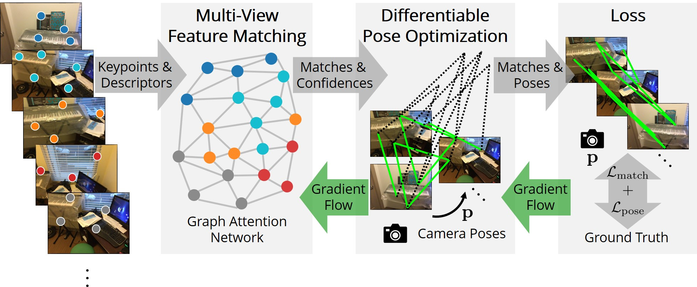

# End2End Multi-View Feature Matching with Differentiable Pose Optimization
This repository contains the implementation of the ICCV 2023 paper: End2End Multi-View Feature Matching with Differentiable Pose Optimization.

[Arxiv](https://arxiv.org/abs/2205.01694) | [Video](https://www.youtube.com/watch?v=uuLb6GfM9Cg) | [Project Page](https://barbararoessle.github.io/e2e_multi_view_matching/)

### Code coming soon!